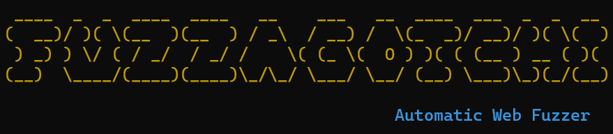

# Fuzzagotchi

An automatic web fuzzer.

<br />

## Status

**This is under development. So only some features work for now.**

<br />

## Usage

### Automatic Fuzzing

This mode automatically fuzzes directories contains **`*.txt`**, **`*.php`**, **`.html`**, etc.

```sh
fuzzagotchi -u https://example.com -w wordlist.txt
```

### Specific Fuzzing

If you want to specify where to fuzz, you can put **"EGG"** keyword in URL, POST params, etc.

```sh
# Directories
fuzzagotchi -u https://example.com/EGG -w wordlist.txt
# Vhosts
fuzzagotchi -u https://example.com -H "Host: EGG.example.com" -w wordlist.txt
# Cookies
fuzzagotchi -u https://example.com -H "Cookie: key=EGG" -w wordlist.txt
```

<br />

## Installation

The easiest way of installation is to install using **`go`** binary.  
Your system needs to have **`go`**.

### Install with Go

```sh
go install github.com/hideckies/fuzzagotchi@latest
```

### Clone This Repo & Build

Another way, you can clone this repository and build.

```sh
git clone https://github.com/hideckies/fuzzagotchi.git
cd fuzzagotchi
go get ; go build
```