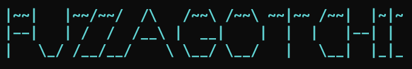

# Fuzzagotchi

A fuzzing tool written in Go. It helps to discover directories, files, parameters, etc. in web applications.  

<br />

## Status

**This is under development. So only some features work for now.**

<br />

## Prerequisites

1. **Seclists**

    Fuzzagotchi uses [seclists](https://github.com/danielmiessler/SecLists) as default wordlist.

    ```sh
    sudo apt install seclists
    ```

<br />

## Example

Fuzzagotchi uses "EGG" keyword for fuzzing.  
As you may have noticed, it imitates **FFUF**ツ

```sh
fuzzagotchi -u https://example.com/EGG -w wordlist.txt
```

<br />

## Usage

```
A fuzzing tool written in Go.

Usage:
  fuzzagotchi [flags]
  fuzzagotchi [command]

Examples:

  [Content Discovery]
        fuzzagotchi -u https://example.com/EGG -w wordlist.txt
        fuzzagotchi -u https://example.com/EGG -w wordlist.txt --status 200,301
        fuzzagotchi -u https://example.com/EGG -w wordlist.txt --no-status 200
        fuzzagotchi -u https://example.com/EGG -w wordlist.txt --content-length 120-175
        fuzzagotchi -u https://example.com/EGG -w wordlist.txt --no-content-length 150
        fuzzagotchi -u https://example.com/EGG -w wordlist.txt -H "Authorization: Bearer <token>"
        fuzzagotchi -u https://example.com/EGG -w wordlist.txt -C "name1=value1; name2=value2"

        fuzzagotchi -u https://example.com/EGG.php -w wordlist.txt
        fuzzagotchi -u https://example.com/?q=EGG -w wordlist.txt

  [Subdomain Scan] *Under development so unavailable currently.
        fuzzagotchi -u https://example.com -w subdomains.txt -H "Host: EGG.example.com" --content-length 500-2000

  [Brute Force Credentials] *Under development so unavailable currently.
        fuzzagotchi -M POST -u https://example.com/login -w passwords.txt --post-data "username=admin&password=EGG"
        fuzzagotchi -M POST -u https://example.com/login -w passwords.txt --post-data "{username:admin, password: EGG}"


Available Commands:
  completion  Generate the autocompletion script for the specified shell
  help        Help about any command
  version     Print the version of fuzzagotchi

Flags:
      --color                      Colorize the output
      --content-length string      Display the specific content length e.g. 120-560 (default "-1")
  -C, --cookie string              Custom cookie e.g. "name1=value1; name2=value2"
      --delay string               Time delay (seconds) per requests e.g. 1.2. Or random delay e.g. 0.8-1.5 (default "0.2-0.5")
  -H, --header string              Custom header e.g. "Authorization: Bearer <token>; Host: example.com"
  -h, --help                       help for fuzzagotchi
  -M, --method string              Specific method e.g. GET, POST, PUT, OPTIONS, etc. (default "GET")
      --no-content-length string   Not display given content length e.g. 320 (default "-1")
      --no-status ints             Not display given status codes.
      --post-data string           POST request with data e.g. "username=admin&password=EGG"
  -s, --status ints                Display given status codes only. (default [200,204,301,302,307,401,403])
  -t, --threads int                Number of concurrent threads. (default 10)
  -u, --url string                 Target URL (required)
  -v, --verbose                    Verbose mode
      --version                    version for fuzzagotchi
  -w, --wordlist string            Wordlist for fuzzing (default "/usr/share/seclists/Discovery/Web-Content/common.txt")

Use "fuzzagotchi [command] --help" for more information about a command.
```

<br />

## Install & Compile

```sh
go get ; go build
```